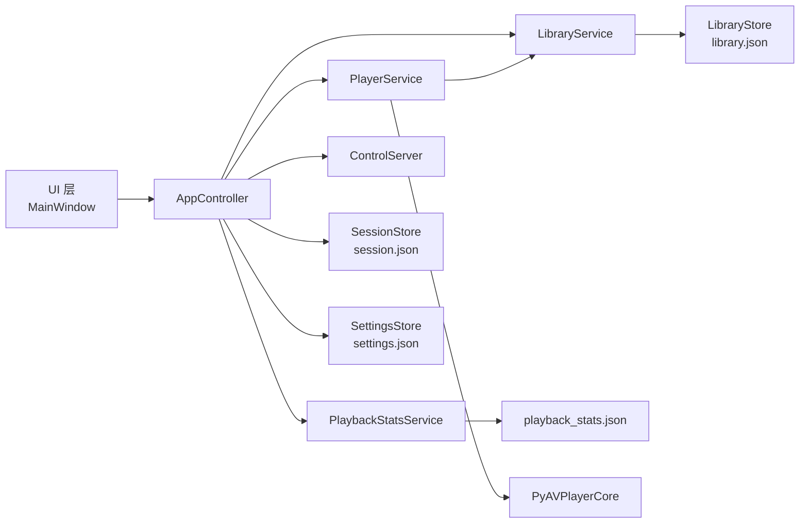

# MusePlayer 架构设计文档（中文）

> 文档目标：说明当前播放器的内部架构、核心数据结构和关键流程，确保后续重构与功能迭代保持一致。

## 1. 总体架构

系统采用"UI 层 + 控制器层 + 服务层 + 存储层 + 播放内核层"分层。

分层原则：
- UI 层只做展示和交互，不直接落盘。
- `AppController` 做编排、生命周期、命令分发。
- 业务规则（导入、播放、统计）在服务层集中。
- 持久化只在 Store 层。

---

## 2. 代码结构（重构后）

`app/ui/main_window.py`
- 主窗口门面文件，仅导出 `MainWindow`，降低入口复杂度。

`app/ui/main_window_impl.py`
- 主窗口核心实现（丰富模式/简洁模式、拖拽缩放、菜单、快捷键、侧边栏联动）。

`app/ui/main_window_helpers.py`
- 主窗口可复用辅助组件：
  - 多提示状态栏 `MultiHintStatusBar`
  - 点击即跳转滑条 `ClickJumpSlider`
  - 歌词/歌单委托绘制
  - Windows 任务栏进度桥接
  - 图标绘制与歌词时间解析工具

`app/ui/main_window_mixins/`
- `playback_mixin.py`：播放、歌词、歌单列表、菜单动作等"业务交互"方法。
- `windowing_mixin.py`：无边框缩放、吸附、拖拽、侧边栏与几何恢复等"窗口行为"方法。

`app/services/player_service_mixins/`
- `stats_mixin.py`：播放统计开关、早期跳过判定、进度增量统计。
- `lazy_decode_mixin.py`：窗口读取、预读取调度、续播衔接、输出增益策略。

---

## 3. 关键数据结构

### 3.1 Track（歌曲实体）
核心字段：
- 基础展示：`title / artist / album / duration_sec / path / track_no / year`
- 外部歌单映射：`source_track_id / source_storage_relpath / source_sha256`
- 歌词映射：`source_lyrics_storage_relpath / source_lyrics_path / extra_lyrics_paths`
  - `extra_lyrics_paths`：额外歌词文件路径，用 `|` 分隔，支持多歌词文件关联（如日语原文+罗马音+翻译）

用途：
- 既支持本地文件导入，也支持数据库导出歌单（`.muse_playlist.json`）回放与回写统计。

### 3.2 Playlist（歌单实体）
核心字段：
- 基础：`id / name / track_ids`
- 外部来源：`source_schema / source_file / source_playlist_hash / source_database_location / source_exported_at`
- `ordered`：布尔值，表示歌单的曲目顺序是否有意义（默认 `true`）。当设为 `false` 时，导入后播放器可按自身排序规则重排曲目；当设为 `true` 时，若用户勾选"优先使用歌单指定的顺序"，则保持导出时的原始顺序

用途：
- 本地歌单管理
- 与外部 DB 导出格式建立可追踪映射

### 3.3 SessionState（会话状态实体）
核心字段：
- `current_playlist_id / current_track_id / position_sec / volume`
- `play_mode`：播放模式（`single_loop` / `playlist_loop` / `random`）
- `random_seed / random_index`：随机播放定位

用途：
- 应用关闭时持久化，启动时恢复上次播放上下文
- `position_sec` 使用 `_safe_position()` 获取，确保懒加载窗口模式下保存的是绝对位置

### 3.4 播放统计（PlaybackStatsEntry）
字段语义：
- `track_id`：歌曲 ID（主键）
- `play_count`：每次开始播放都记一次
- `active_play_count`：主动触发播放计数
- `early_skip_count`：前 5% 被切走计数
- `played_seconds_total`：累计播放秒数
- `played_percent_total`：累计播放百分比（可超过 100%）
- `updated_at`：最后更新时间戳

### 3.5 Settings（设置实体）

完整字段见 `docs/ARCHITECTURE.md` 第 6 节。按功能分区：

**播放设置**：`auto_restore_session / enable_single_loop_mode / enable_playlist_loop_mode / prefer_playlist_order / playlist_loop_sort / random_display_order / collect_playback_data`

**歌词设置**：`show_japanese_lyrics / show_romaji`

**音频设置**：`global_gain_boost / read_strategy / output_device`

**界面设置**：`dark_theme / remember_window_geometry / max_window_width / max_window_height / window_x / window_y / window_width / window_height`

**网络控制接口**：`control_interface_enabled / control_host / control_port`

**数据与日志**：`timed_save_enabled / timed_save_minutes / logging_enabled / crash_logging_enabled / data_maintenance_logging_enabled`

---

## 4. 导入流程设计

### 4.1 文件夹导入
入口：`LibraryService.import_folder(...)`

流程：
1. 扫描所选目录下音频文件（根目录歌曲归入根歌单）。
2. 仅扫描第一级子目录，每个子目录单独建/复用歌单。
3. 导入过程做去重映射，避免重复曲目膨胀。
4. 完成后刷新"全部歌曲"与相关歌单。

设计原因：
- 用户常用"目录即歌单"组织方式。
- 第一级限制可控，避免深层目录导入不可预期。

### 4.2 数据库歌单导入（`.muse_playlist.json`）
入口：
- 文件导入：`import_muse_playlist(file_path)`
- 直接数据导入：`import_muse_playlist_payload(payload)`（控制接口可直接传 JSON）

流程要点：
1. 校验 `schema == musearc_playlist_export_v2`。
2. 解析歌曲元信息与 `storage_relpath` 映射真实文件路径。
3. 解析 `lyrics` 数组，支持多语言歌词（original/japanese/romaji/translation）。
4. 保留 `source_*` 字段用于后续统计回写。
5. `ordered` 字段控制是否保持原始顺序。

### 4.3 拖拽导入
- 纯 `.lrc` 文件：附加到当前播放歌曲的歌词关联
- 音频文件：导入为歌曲（自动跳过非音频文件和 `.lrc` 文件，因为 lrc 在歌曲导入时自动识别）
- 文件夹：导入为新歌单，歌单名称为文件夹名称

---

## 5. 播放流程与随机播放设计

### 5.1 播放核心流程
入口：`PlayerService.play_track(...)`

主要步骤：
1. 校验目标曲目存在并可访问。
2. 维护顺序索引/随机索引。
3. 加载解码（窗口模式或全量模式）。
4. 触发播放状态信号与进度更新。
5. 在切歌时判定上一首是否属于 early skip。

### 5.2 随机播放（seed + idx）
状态字段：
- `random_seed`（范围 1~2,000,000,000，溢出后回绕到 1）
- `random_index`

规则：
1. 固定歌单 + 固定 seed => 固定乱序结果。
2. `random_index` 表示当前乱序序列中的位置。
3. 到序列末尾时 `seed += 1` 生成新序列。
4. 中途手动选歌时也 `seed += 1`，并重新定位 index，保证后续随机链路稳定。
5. 当设置"随机后顺序"显示时，双击曲目不触发 seed 自增（`preserve_random=True`）。

该设计保证：
- 随机模式下仍然能稳定"上一首/下一首"。
- 应用重启后可恢复随机链路上下文。

### 5.3 歌单循环排序
当播放模式为歌单循环时，可通过 `playlist_loop_sort` 设置排序方式：
- `default`：歌单导入默认顺序
- `title`：按歌名排序
- `artist`：按歌手排序

`prefer_playlist_order` 复选框：勾选后优先使用歌单指定的顺序（即 `ordered=true` 的歌单保持原始顺序）。

### 5.4 随机模式显示顺序
`random_display_order` 设置控制歌单列表在随机模式下的显示：
- `original`：显示随机前的原始顺序（默认）
- `random`：显示随机后的顺序，此时双击曲目不重新随机 seed，直接改变 idx

---

## 6. 音频读取策略

设置项：`read_strategy`
- `window`（默认）
- `full`

### 6.1 window 策略
- 首次先加载约 6.2s 窗口。
- 后台预读取下一窗口。
- 播放接近窗口末尾时切入预读取结果，尽量降低卡顿。

### 6.2 full 策略
- 一次性加载整首音频。
- 路径简单、兼容性强，但首载开销更高。

### 6.3 输出设备
`output_device` 设置：
- 空字符串：跟随系统默认设备
- 指定设备名：使用指定音频输出设备

切换输出设备时，`core.set_output_device` 会同步停止旧流、打开新流并恢复播放。设备未变化时跳过流重开，避免播放中断。

### 6.4 全局增益
`global_gain_boost` 设置：
- 默认 1.0（无增益）
- 允许 >1.0 增强音量（如 2.0 = 两倍增益）
- 与用户音量百分比相乘得到最终音量

---

## 7. 统计设计与保存策略

### 7.1 统计触发
- `play_count`：每次播放起点触发
- `active_play_count`：主动操作触发
- `early_skip_count`：切歌时检查"上一首播放比例 < 5%"；加入"我喜欢"时归零
- `played_percent_total`：每 tick 增量累加

### 7.2 不应统计的场景
- 启动恢复会话
- 应用退出保存流程

实现：`PlayerService.suspend_stats_collection()`
- 在 `restore_session` 与 `AppController.shutdown` 中包裹使用。

### 7.3 保存机制
- 手动：菜单 `文件 -> 保存统计数据`（`Ctrl+S`）
- 定时：`timed_save_enabled` + `timed_save_minutes`（可配置分钟间隔）
- 关闭：`shutdown()`
- 兜底：`aboutToQuit / atexit / sys.excepthook / threading.excepthook / SIGINT/SIGTERM`

### 7.4 日志系统
- 应用日志：`logging_enabled` 控制，同一次运行始终使用同一个日志文件
- 崩溃日志：`crash_logging_enabled` 控制，使用固定 `crashlog.log` 文件，崩溃后由后处理程序改名持久化
- 数据维护日志：`data_maintenance_logging_enabled` 控制，记录数据清理操作

---

## 8. 控制接口协议（运行时）

实现：`ControlServer + AppController.dispatch_command`。

已支持命令：
- `play / pause / toggle / seek / next / previous`
- `set_volume / set_mode`
- `import_folder / import_playlist_file / import_playlist_data`
- `play_file / load_playlist / play_playlist / play_track`
- `current_track / current_playlist / get_playlist`
- `create_playlist / add_track_to_playlist / remove_track_from_playlist`
- `state / ping`

详细协议见 `docs/CONTROL_PROTOCOL.md`。

---

## 9. UI 交互细节

### 9.1 模式
- 丰富模式：完整信息与管理能力
- 简洁模式：控制优先，窗口无边框、可置顶、可锁定位置、透明度可调

### 9.2 无边框行为
- 边缘拉伸：通过 `WM_NCHITTEST`
- 标题栏吸附：顶部最大化，左右半屏
- 最大化/吸附后拖动标题栏：先还原再拖动

### 9.3 状态栏
`MultiHintStatusBar` 支持多提示并存，用 `-` 连接，例如：
- 播放状态
- 音量状态
- 下一首预告

### 9.4 主题切换
- 日间/夜间主题一键切换
- 切换时不触发歌曲列表刷新（通过 `_skip_next_settings_reload` 标志跳过）

### 9.5 歌词显示
- 标准 LRC 格式歌词
- QRC 格式歌词（QQ音乐增强歌词，含行级/字级时间标签和假名注音）
- 多歌词合并显示：日语原文 + 罗马音 + 翻译分行显示
- 设置控制：`show_japanese_lyrics` / `show_romaji`
- 拖入歌词文件自动关联到当前歌曲

---

## 10. 回写到数据库歌单格式

在 `save_session()/定时保存/手动保存` 时，`sync_muse_playlist_stats(...)` 会回写：
- 每首歌：`play_count / manual_play_count / play_seconds / early_skip_count`
- 汇总字段：总播放次数、总主动播放次数、总早期跳过次数等

回写原则：
- 仅更新可匹配曲目
- 本地无统计时不覆盖文件已有统计值

---

## 11. 后续重构建议

1. 为控制协议补充版本号与 schema 校验，增强兼容性。
2. 补充自动化测试：
   - 随机序恢复一致性
   - early skip 判定边界
   - DB 歌单导入/回写回归测试
